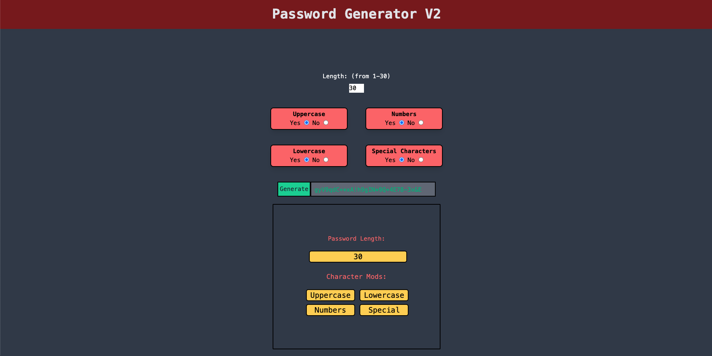

# Password-Genrator-V2

 
 

## **Description**
* A more refined and better looking password generator.
 
 

## **Table of Contents**
- [Installation](#Installation)  
- [Usage](#Usage)  
- [License](#License)  
- [Contributing](#Contributing)  
- [Tests](#Tests)  
- [Questions](#Questions)  
- [Screenshot](#Screenshot)  
- [Link](#Link)  
 
 

## **Installation**
* There is no installation.
 
 

## **Usage**
* Takes in a users choices and then picks a random character from each choice. Then takes all characters, concatenates and randomizes them into one string.
 
 

## **Updates**
* Added a grid to the choice results to make it fill more of the space horizontally.
 
 

## **License**
### *MIT*  
        A short and simple permissive license with conditions only requiring preservation of copyright and license notices. Licensed works, modifications, and larger works may be distributed under different terms and without source code.
 

## **Contributing**
* No contributions at this time.
 
 

## **Tests**
    
* No tests
 
 

## **Questions**
* GitHub: https://github.com/KevinHenleyCode

* For more questions you can reach me at my Email:(kevinhenleyinfo@gmail.com)

 
 

## **Screenshot**

 
 

## **Link**
[Site](https://kevinhenleycode.github.io/Password-Genrator-V2/)